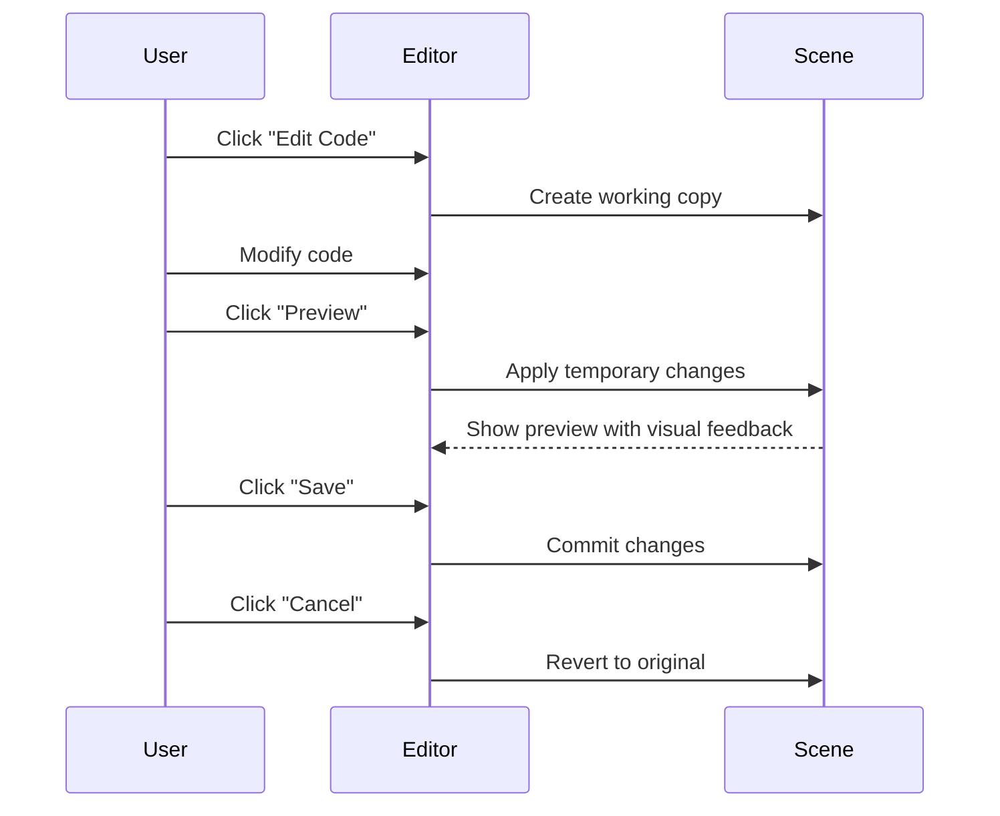
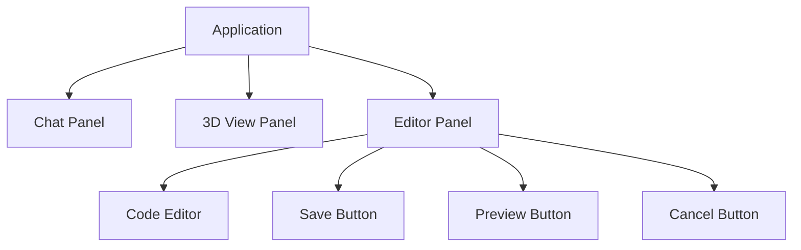
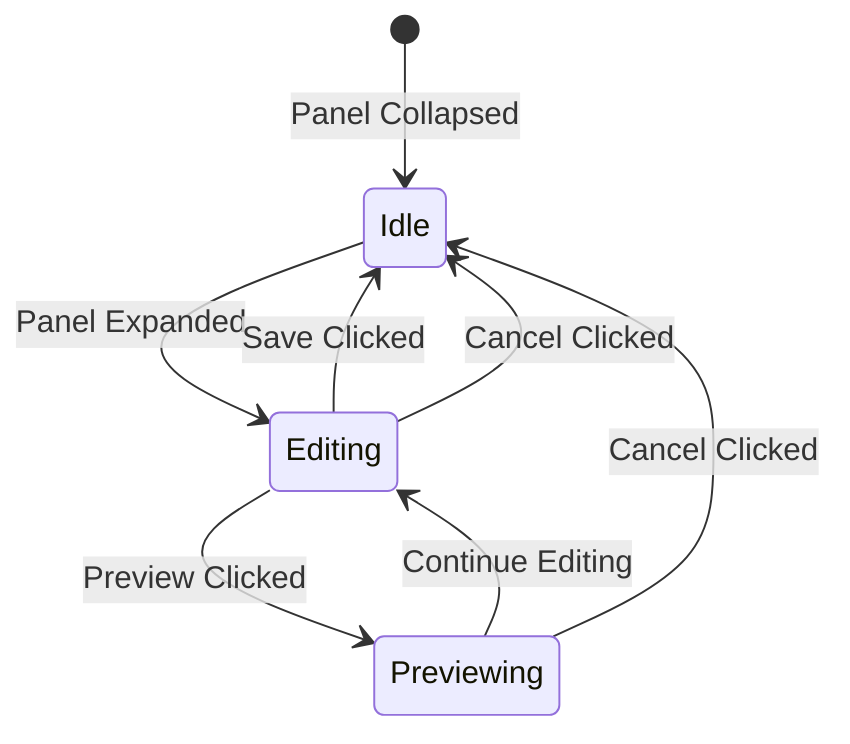

# Advanced Editor Panel Plan

## Vision
Enable advanced users to directly manipulate 3D objects through code while maintaining a safe editing environment with preview capabilities. The editor panel provides a bridge between visual 3D manipulation and direct code editing, allowing for more complex and precise object creation and modification.

## Goals
1. Provide real-time code editing with syntax highlighting for JavaScript
2. Implement safe preview mode with visual feedback
3. Maintain original code integrity until explicitly saved
4. Create intuitive user workflow for code editing
5. Support advanced users who prefer direct code manipulation

## User Workflow

## UI Structure

## Technical Implementation

### Components
1. **EditorPanel**
   - Manages editor UI state (collapsed/expanded)
   - Handles button interactions
   - Coordinates with SceneManager
   - Provides visual feedback for preview mode

2. **CodeEditor**
   - Uses CodeMirror for syntax highlighting
   - Provides code validation
   - Maintains editor state
   - Handles code formatting

3. **TemplateManager**
   - Manages template versions (main and editor)
   - Handles template validation
   - Provides diff functionality
   - Ensures safe code execution

### State Management

### Template Version Management
The system will maintain two versions of the template:
1. **mainTemplate**: The official template used for rendering
2. **editorTemplate**: The working copy in the editor

When the user clicks:
- **Preview**: The scene renders using editorTemplate temporarily
- **Save**: editorTemplate becomes the new mainTemplate
- **Cancel**: editorTemplate is discarded and reset to mainTemplate

### Visual Feedback for Preview Mode
When in preview mode, the 3D panel will show a visual indicator (colored border) to signify that the current view is a preview and not the saved state. This provides clear feedback to the user about the current state of the application.

### Security Considerations
1. **Sandboxed code execution**: Ensure that user-provided code executes in a controlled environment
2. **Template validation**: Validate templates before execution to prevent errors
3. **Error handling**: Provide clear error messages for invalid code
4. **Memory management**: Clean up resources when switching between templates

## Implementation Steps
1. Add EditorPanel class and UI elements
2. Integrate CodeMirror for syntax highlighting
3. Add template version management
4. Implement preview/save/cancel logic
5. Add visual feedback for preview mode
6. Test with various code examples
7. Add error handling and validation

## Technical Considerations

### CodeMirror Integration
CodeMirror provides robust syntax highlighting and code editing capabilities. It can be configured with:
- JavaScript mode for syntax highlighting
- Theme customization to match application style
- Auto-indentation and code formatting
- Line numbers and error indicators

### Panel Layout
The editor panel will:
- Span the full width of the application
- Be positioned below the existing chat and 3D panels
- Be collapsible to save screen space when not in use
- Expand to a reasonable height when active

### Performance Considerations
- Debounce preview updates to prevent excessive rendering
- Optimize template switching to minimize flickering
- Consider lazy-loading CodeMirror to improve initial load time
